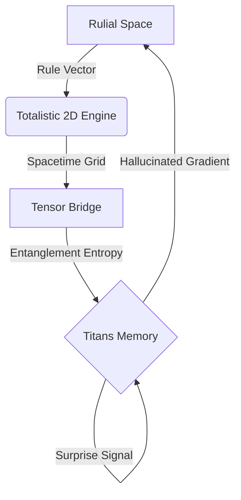

# Rulial Navigator: Autonomous Discovery Engine

The **Rulial Navigator** is a hybrid classical/quantum framework designed to autonomously explore, map, and classify the computational universe ("Rulial Space").

It combines high-performance Cellular Automata simulation with **Quantum-Topological Data Analysis** to detect complex behaviors (Wolfram Class 4), distinguishing "Gold Filaments" of computation from the "ice" of order and the "fire" of chaos.

## 🌟 Key Features

### 🧠 The Navigator (Hybrid Core)
- **Swarm Intelligence:** Autonomous probes explore Rule Space using Hamming distance swarms.
- **Adiabatic Annealing:** Dynamically adjusts exploration temperature (mutation rate) based on the "Interestingness Gradient".
- **Semantic Navigation:** Uses **Quantum Kernels** (Qiskit) to find rules with similar semantic fidelity, not just bitwise proximity.

### 🔬 The Mapper (V2 Quantum Layer)
- **Superfluid Filter:** Measures **Entanglement Entropy** of the Space-Time matrix (via Quimb/SVD).
  - *Hypothesis:* Life-like complexity exists in a "Superfluid" phase transition between Order and Chaos (Entropy ~0.94).
- **ZX Reducer:** Analyzes **Computational Irreducibility** using ZX-Calculus (PyZX).
  - Maps the "Active Causal Graph" to a Quantum Circuit.
  - Measures **Logical Depth** via topological rigidity (reduction ratio).
### 🌍 The Physics (2D Totalistic Engine)
- **Engine:** Vectorized `scipy` engine for Outer Totalistic 2D CA (e.g., Game of Life).
- **Rule Space:** Explores the 262,143 rules of the Moore Neighborhood (18-bit genome).

### ⛩️ The Tensor Bridge (Quantum V3)
- **Theory:** Maps 2D Grid $\to$ Quantum Cluster State using Projected Entangled Pair States (PEPS).
- **Metric:** Computes **Bi-partition Entanglement Entropy** to detect topological order.
- **Safety:** Implements "Observer Cut" (16x16 window) and Volume Law detection to manage exponential complexity.

### 🤖 Rulial Titans (Cognitive Layer)
- **Test-Time Training:** A PyTorch neural memory that learns *online* during exploration.
- **Surprise-Driven:** Updates its internal model based on the difference between "Predicted Entropy" and "Actual Entropy".
- **Hallucination:** Uses its learned intuition to predict promising neighbors before simulating them.

---

## 🚀 Installation

This project is managed with `uv`.

```bash
# Clone the repository
git clone https://github.com/yourusername/rulial-navigator.git
cd rulial-navigator

# Install dependencies
uv sync
```

**Requirements:**
- Python 3.11+
- `quimb`, `torch`, `rich`, `scipy`, `numpy`

---

## 🕹️ Usage

The system exposes a CLI `rulial` for interaction.

### 1. The Autonomous Agent (V3)
Launch the **Rulial Titans** to explore the 2D Totalistic Universe. This runs the full loop: Physics $\to$ Quantum Bridge $\to$ Neural Memory.

```bash
uv run rulial probe-2d --epochs 1000
```
*Optional: Increase observation window for more detail (high RAM usage):*
```bash
uv run rulial probe-2d --window 32
```

### 2. Quantum Probe (V2)
Analyze a specific 1D rule (Legacy V2 system).

```bash
uv run rulial probe 110
```

### 3. Data Analysis
Process the findings from your autonomous run.

```bash
uv run python analyze_results.py
```

---

## 📐 Architecture (The Trinity)



---

## 🧪 Scientific Validation

| Rule | V1 Class | Superfluid Entropy | Status |
|------|----------|--------------------|--------|
| **0** | Rigid | 0.00 | **Ice** |
| **30** | Chaos | 0.97 | **Fire** |
| **110**| Complex| 0.94 | **Gold** |
| **224 (Life)** | Complex | ~1.00 (Split) | **Life-like** |

---

## 🔮 Roadmap
- [x] **Phase 1-5:** Legacy V1 Engine (Completed)
- [x] **Phase 6:** V2 Quantum Layer (Completed)
- [x] **Phase 7:** 2D Totalistic Rules (Completed)
- [x] **Phase 8:** Tensor Bridge (Completed)
- [x] **Phase 9:** Rulial Titans Cognition (Completed)
- [x] **Phase 10:** Autonomous Integration (Completed)
- [ ] **Phase 11:** 3D WebGL Atlas
