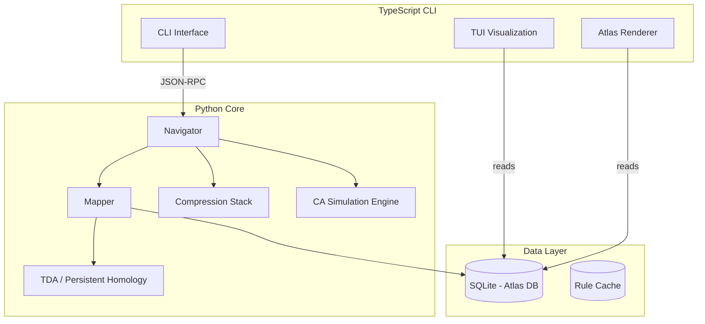

# Rulial Navigator: Autonomous Discovery Engine

> An implementation of the theoretical framework from [Mapping-Infinite-Rulial-Space.md](file:///home/ty/Repositories/ai_workspace/rulial-navigator/docs/Mapping-Infinite-Rulial-Space.md) for navigating computational rule spaces.

## Executive Summary

This plan implements a **hybrid Python + TypeScript** system for autonomous exploration of Rulial Space, starting with **1D Elementary Cellular Automata (ECA)**. The system will navigate the 256-rule ECA space using compression gradients, classify Wolfram classes in real-time, and map discovered complexity using Topological Data Analysis.

---

## User Review Required

> [!IMPORTANT]
> **NCA Integration Decision Required**
> Neural Cellular Automata present significant challenges for MVP. See [Section: NCA Challenges](#nca-challenges-and-options) below for detailed analysis and proposed alternatives.

> [!NOTE]
> **1D vs 2D Decision Rationale**
> 1D ECA (256 rules) is the correct MVP choice. The core algorithms (compression gradients, TDA, adiabatic annealing) are *identical* for 1D and 2D—only the simulation kernel changes. Starting with 1D lets us validate the entire architecture before scaling to 2D's ~262k+ rule space.

---

## Architecture Overview



---

## Proposed Changes

### Core Package Structure

```
rulial-navigator/
├── docs/
│   └── Mapping-Infinite-Rulial-Space.md
├── src/
│   └── rulial/                    # Python package
│       ├── __init__.py
│       ├── engine/
│       │   ├── __init__.py
│       │   ├── eca.py             # 1D Elementary CA simulation
│       │   └── spacetime.py       # Space-time diagram generation
│       ├── compression/
│       │   ├── __init__.py
│       │   ├── rigid.py           # LZMA/GZIP L1 compression
│       │   ├── neural.py          # LSTM L2 compression (or proxy)
│       │   └── metrics.py         # Compression progress calculation
│       ├── navigator/
│       │   ├── __init__.py
│       │   ├── swarm.py           # Hamming neighbor probe swarm
│       │   ├── gradient.py        # Compression gradient calculation
│       │   ├── annealing.py       # Adiabatic temperature control
│       │   └── classifier.py      # Wolfram class heuristics
│       ├── mapper/
│       │   ├── __init__.py
│       │   ├── topology.py        # TDA / Persistent Homology
│       │   ├── entailment.py      # Entailment cone construction
│       │   └── atlas.py           # Atlas of Ignorance database
│       └── server/
│           ├── __init__.py
│           └── rpc.py             # JSON-RPC server for CLI
├── cli/                           # TypeScript CLI
│   ├── package.json
│   ├── tsconfig.json
│   ├── src/
│   │   ├── index.ts               # CLI entry point
│   │   ├── client.ts              # Python RPC client
│   │   ├── commands/
│   │   │   ├── navigate.ts        # Start navigation session
│   │   │   ├── probe.ts           # Single rule probe
│   │   │   └── atlas.ts           # View/export atlas
│   │   └── ui/
│   │       ├── dashboard.ts       # TUI dashboard (blessed/ink)
│   │       └── heatmap.ts         # ASCII heatmap renderer
│   └── dist/
├── data/
│   └── atlas.db                   # SQLite atlas database
├── pyproject.toml
├── README.md
└── .gitignore
```

---

### Component 1: CA Simulation Engine

#### [NEW] [eca.py](file:///home/ty/Repositories/ai_workspace/rulial-navigator/src/rulial/engine/eca.py)

The 1D Elementary Cellular Automata engine.

**Implementation:**
- Rule representation as 8-bit lookup table (0-255)
- Vectorized NumPy simulation for performance
- Configurable grid width and simulation steps
- Support for initial conditions: `random`, `single_seed`, `custom`

**Key Function:**
```python
def simulate(rule: int, width: int, steps: int, 
             init: Literal["random", "single_seed"] = "single_seed") -> np.ndarray:
    """
    Simulate ECA rule and return space-time diagram.
    
    Returns:
        np.ndarray of shape (steps, width) with values 0 or 1
    """
```

#### [NEW] [spacetime.py](file:///home/ty/Repositories/ai_workspace/rulial-navigator/src/rulial/engine/spacetime.py)

Utilities for space-time diagram manipulation.
- Serialization to bytes for compression
- Visualization helpers
- Causal graph extraction for TDA

---

### Component 2: Compression Stack

#### [NEW] [rigid.py](file:///home/ty/Repositories/ai_workspace/rulial-navigator/src/rulial/compression/rigid.py)

L1 rigid compression using standard algorithms.

```python
def compress_ratio_lzma(data: bytes) -> float:
    """Returns compression ratio: len(compressed) / len(raw)"""

def compress_ratio_gzip(data: bytes) -> float:
    """Returns compression ratio using gzip"""
```

#### [NEW] [neural.py](file:///home/ty/Repositories/ai_workspace/rulial-navigator/src/rulial/compression/neural.py)

L2 neural compression using sequence prediction.

> [!NOTE]
> For MVP, we'll use a **pre-trained byte-level model** or train a small LSTM on CA patterns. The key metric is *prediction error rate* which inversely correlates with compressibility.

```python
class NeuralCompressor:
    def __init__(self, model_path: Optional[str] = None):
        """Load or initialize neural predictor"""
    
    def compression_progress(self, 
                             spacetime: np.ndarray, 
                             window: int = 100) -> list[float]:
        """
        Calculate compression progress over time.
        Returns list of derivatives: dC/dt at each time step.
        """
```

#### [NEW] [metrics.py](file:///home/ty/Repositories/ai_workspace/rulial-navigator/src/rulial/compression/metrics.py)

Unified compression metrics.

```python
@dataclass
class CompressionTelemetry:
    rigid_ratio: float           # L1 compression ratio
    neural_progress: list[float] # L2 compression progress over time
    mean_progress: float         # Average dC/dt
    entropy: float               # Shannon entropy of spacetime
    
def analyze(spacetime: np.ndarray) -> CompressionTelemetry:
    """Full compression analysis of a spacetime diagram"""
```

---

### Component 3: Navigator

#### [NEW] [swarm.py](file:///home/ty/Repositories/ai_workspace/rulial-navigator/src/rulial/navigator/swarm.py)

Hamming neighbor exploration.

```python
def hamming_neighbors(rule: int, distance: int = 1) -> list[int]:
    """
    Generate all rules within Hamming distance of the given rule.
    For distance=1, returns 8 neighbors (one per bit flip in 8-bit rule).
    """

def spawn_probes(center: int, 
                 count: int, 
                 temperature: float) -> list[int]:
    """
    Spawn probe rules around center.
    Higher temperature = larger Hamming distances.
    """
```

#### [NEW] [gradient.py](file:///home/ty/Repositories/ai_workspace/rulial-navigator/src/rulial/navigator/gradient.py)

Compression gradient calculation.

```python
@dataclass
class ProbeResult:
    rule: int
    telemetry: CompressionTelemetry
    wolfram_class: int  # 1, 2, 3, or 4
    interestingness: float  # Composite score

def calculate_gradient(center: int, 
                       probes: list[ProbeResult]) -> tuple[int, float]:
    """
    Calculate the gradient direction in rule space.
    Returns (best_neighbor_rule, gradient_magnitude).
    """
```

#### [NEW] [annealing.py](file:///home/ty/Repositories/ai_workspace/rulial-navigator/src/rulial/navigator/annealing.py)

Adiabatic temperature control.

```python
class AnnealingController:
    def __init__(self, 
                 initial_temp: float = 1.0,
                 min_temp: float = 0.1,
                 max_temp: float = 5.0):
        self.temperature = initial_temp
        self.gradient_history: list[float] = []
    
    def update(self, gradient_magnitude: float) -> float:
        """
        Update temperature based on gradient.
        - Gradient flat → heat up (explore)
        - Gradient positive → cool down (exploit)
        Returns new temperature.
        """
```

#### [NEW] [classifier.py](file:///home/ty/Repositories/ai_workspace/rulial-navigator/src/rulial/navigator/classifier.py)

Wolfram class heuristic classification.

```python
def classify_wolfram(telemetry: CompressionTelemetry) -> int:
    """
    Classify rule into Wolfram class (1-4) using heuristics:
    
    Class 1: High compression, zero progress (frozen)
    Class 2: High compression, zero progress (periodic)  
    Class 3: Low compression, zero progress (chaotic)
    Class 4: Medium compression, POSITIVE progress (complex)
    """
```

---

### Component 4: Mapper & TDA

#### [NEW] [topology.py](file:///home/ty/Repositories/ai_workspace/rulial-navigator/src/rulial/mapper/topology.py)

Topological Data Analysis using Persistent Homology.

```python
from ripser import ripser

@dataclass
class TopologicalSignature:
    betti_0: int              # Connected components
    betti_1: int              # Loops (gliders, oscillators)
    persistence_entropy: float # Stability of features
    max_persistence: float    # Longest-lived feature
    barcode: list[tuple[float, float]]  # Birth-death pairs

def compute_persistence(spacetime: np.ndarray) -> TopologicalSignature:
    """
    Compute persistent homology of the causal structure.
    Converts spacetime diagram to point cloud and computes Vietoris-Rips.
    """
```

#### [NEW] [atlas.py](file:///home/ty/Repositories/ai_workspace/rulial-navigator/src/rulial/mapper/atlas.py)

The Atlas of Ignorance database.

```python
class Atlas:
    def __init__(self, db_path: str = "data/atlas.db"):
        """Initialize SQLite-backed atlas"""
    
    def record(self, rule: int, 
               telemetry: CompressionTelemetry,
               topology: TopologicalSignature,
               wolfram_class: int):
        """Record exploration result"""
    
    def get_heatmap(self) -> dict[int, str]:
        """
        Returns rule → color mapping:
        - "black": unexplored
        - "red": Class 3 (chaos)
        - "blue": Class 1/2 (order)
        - "gold": Class 4 (complexity)
        """
    
    def get_gold_filaments(self) -> list[int]:
        """Return all Class 4 rules discovered"""
```

---

### Component 5: TypeScript CLI

#### [NEW] [cli/src/index.ts](file:///home/ty/Repositories/ai_workspace/rulial-navigator/cli/src/index.ts)

Main CLI entry point using Commander.js.

**Commands:**
```bash
# Start Python backend and run navigation session
rulial navigate --steps 1000 --start-rule 110

# Probe a single rule and show analysis
rulial probe 110

# View the current atlas
rulial atlas --format ascii|json|svg

# Export atlas visualization
rulial export atlas.png
```

#### [NEW] [cli/src/ui/dashboard.ts](file:///home/ty/Repositories/ai_workspace/rulial-navigator/cli/src/ui/dashboard.ts)

Interactive TUI dashboard using `blessed` or `ink`.

**Features:**
- Real-time compression progress graph
- Current rule visualization (space-time preview)
- Temperature gauge (annealing state)
- Mini-atlas heatmap
- Navigation log

---

## NCA Challenges and Options

Neural Cellular Automata (Section 5.2 of the framework) proposes making rule space **differentiable** for gradient descent navigation. Here are the challenges:

### Challenge 1: Discrete → Continuous Mapping

**Problem:** ECA rules are discrete (8-bit lookup tables). NCAs replace this with a neural network $R_\theta$ that outputs continuous values which are then thresholded.

**Issue:** The discrete → continuous → discrete round-trip introduces:
- Loss of fidelity (the discretized NCA may not match any real ECA rule)
- Gradient noise at threshold boundaries
- Requirement to train the NCA from scratch

### Challenge 2: Loss Function Design

**Problem:** The proposed loss function is:
$$L(\theta) = -(\alpha \cdot \text{CompressionProgress} + \beta \cdot \text{PersistentBettiNumbers})$$

**Issues:**
- **Compression progress** requires running the full simulation—backprop through time is expensive
- **Betti numbers** from persistent homology are not natively differentiable
- Both metrics require the *full* spacetime output, creating memory pressure

### Challenge 3: Computational Cost

**Problem:** Each gradient step requires:
1. Forward pass through the NCA for T steps (O(T × W × params))
2. Backward pass through time (O(T × W × params))
3. Running compression + TDA on output

For T=1000 steps, this is ~1000x more expensive than discrete probing.

---

### Proposed Solutions

#### Option A: Defer NCA (Recommended for MVP)

Use discrete navigation (swarm + gradient ascent + annealing) for MVP. The Navigator already works effectively without differentiability—we're doing **discrete gradient ascent** in Hamming space.

**Pros:** Faster to implement, proven to work, lower compute
**Cons:** May miss some continuous structure

#### Option B: Surrogate Gradient Approach

Train a small neural network to *predict* the interestingness score of a rule from its 8-bit encoding. Use this as a differentiable surrogate.

```python
class InterestingnessSurrogate(nn.Module):
    """Predicts interestingness from rule encoding"""
    def forward(self, rule_encoding: Tensor) -> float:
        # 8-bit input → predicted interestingness
```

**Pros:** Enables gradient-based search, amortizes compute
**Cons:** Requires training data, may miss novel complexity

#### Option C: Differentiable TDA (Research-Grade)

Use recent work on **differentiable persistent homology** (e.g., `TopologyLayer` from `topologylayer` package) to make Betti numbers differentiable.

**Pros:** True end-to-end differentiability
**Cons:** Bleeding-edge, unstable, high complexity

#### Option D: Hybrid Discrete-Continuous

Use discrete navigation to find promising regions, then switch to NCA for fine-grained continuous refinement within those regions.

**Pros:** Best of both worlds
**Cons:** Adds complexity, two navigation modes

---

### My Recommendation

> [!TIP]
> **Start with Option A (Discrete Navigation) for MVP.** The discrete swarm + annealing approach is sufficient to discover Class 4 rules in the 256-rule ECA space. Once validated, we can add Option B (Surrogate) or Option D (Hybrid) as enhancements.

The 256-rule ECA space is small enough that discrete exploration is tractable. NCA becomes valuable when scaling to larger spaces (2D CA, hypergraph rewriting) where exhaustive discrete search fails.

---

## Verification Plan

### Automated Tests

```bash
# Unit tests for CA simulation
pytest tests/test_eca.py

# Compression metric validation
pytest tests/test_compression.py

# Navigator gradient calculation
pytest tests/test_navigator.py

# TDA persistence computation
pytest tests/test_topology.py

# Integration test: full navigation loop
pytest tests/test_integration.py
```

### Validation Criteria

1. **Rule 110 Detection:** The Navigator must discover Rule 110 (known Class 4) when starting from a random rule within reasonable steps.

2. **Class Separation:** The classifier must correctly separate known rules:
   - Class 1: Rule 0, Rule 255
   - Class 2: Rule 4, Rule 108
   - Class 3: Rule 30, Rule 45
   - Class 4: Rule 110, Rule 54

3. **Compression Progress:** Class 4 rules must show sustained positive compression progress; Class 3 rules must show ~zero progress.

4. **Atlas Consistency:** All 256 rules, when fully explored, must be correctly colored in the atlas.

---

## Implementation Order

| Phase | Components | Estimated Effort |
|-------|------------|------------------|
| 1 | Project setup, Python package, TypeScript CLI skeleton | 2-3 hours |
| 2 | CA Simulation Engine (ECA + spacetime) | 1-2 hours |
| 3 | Compression Stack (rigid + metrics) | 2-3 hours |
| 4 | Navigator (swarm, gradient, classifier, annealing) | 3-4 hours |
| 5 | Mapper (TDA, atlas) | 2-3 hours |
| 6 | CLI commands + dashboard | 3-4 hours |
| 7 | Integration, testing, docs | 2-3 hours |

**Total: ~15-22 hours of development**

---

## Next Steps

Upon approval:
1. Initialize Python package with `uv` and TypeScript CLI
2. Implement CA simulation engine
3. Build compression stack
4. Implement Navigator loop
5. Add TDA mapper
6. Build CLI interface
7. Integration testing

